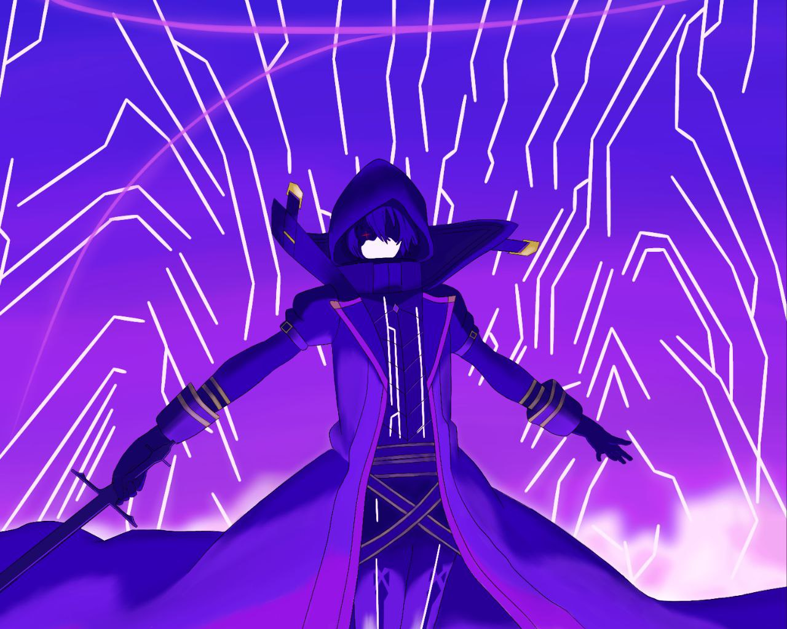

<p align="center">
  
</p>
<h1 align="center">
  <b>ᴄɪᴅ ꭙ ᴘʀᴇᴍɪᴜᴍ​</b>
</h1>

<b>A stable pluggable Telegram userbot + Voice & Video Call music bot, based on Telethon and Pyrogram</b>

<a href="https://github.com/Pinxrobtik/Cid-Prem/commits"> </a>
[](https://github.com/Pinxrobtik/Cid-Prem)
[](https://GitHub.com/Pinxrobtik/Cid-Prem/graphs/commit-activity)
[](https://app.codacy.com/gh/Pinxrobtik/Cid-Prem/dashboard)
[](https://github.com/Pinxrobtik/Cid-Prem/fork)
[](https://github.com/Pinxrobtik/Cid-Prem/stargazers)
----

## Disclaimer

```
Saya tidak bertanggung jawab atas penyalahgunaan bot ini.
Bot ini dimaksudkan untuk bersenang-senang sekaligus membantu anda
mengelola grup secara efisien dan mengotomatiskan beberapa hal yang membosankan.
Gunakan bot ini dengan risiko Anda sendiri, dan gunakan userbot ini dengan bijak.
```

# DATABASE REQUIRETMENTS CHOOSE ONE :
- MONGODB
- REDIS

# Tutorial To Get Redis DB URL and Password


## Process For Creating DB :-   
- Go To [Redis.com](Https://redis.com) and click "`Try Free`" in Top Right Corner.   
- Fill All The Required Details Like email, first and last name, password, etc.   
- Tick Below "I agree the corresponding...Privacy Policy." and Click "Get Started".   
- Now Check Your Email, and click the "Activate Now" sent by redislabs via email.   
- Now Login and Chose Free Plan in "Fixed Size" Area and Write any name in "Subscription Area".   
- On the Next Page Write Database Name and click Activate.   
   
> Congrats! Your DB has been created 🥳   
   
## Process For Getting DB Credentials:-   
- Wait 5 mins after DB creation.   
- Then There Would Be 2 Things Named "`Endpoint`" and "`Access Control & Security`".   
- Copy Both Of Them and Paste Endpoint url in `REDIS_URI` and "Access ...Security" in `REDIS_PASSWORD`.   


<details>
<summary><b>🔗 Deploy di VPS</b></summary>
<br>

 • `git clone https://github.com/Pinxrobtik/Cid-Prem`

 • `cd cid`
 
 • `pip3 install -r req*`

 • `nano .env`
  - Jika anda menggunakan mongodb maka isi pada .env MONGO_URI tetapi jika anda menggunakan redis maka isi REDIS_URI dan REDIS_PASSWORD
  - isi vars .env API_ID, API_HASH, DAN SESSION
  - Jika sudah 
  - ketik ctrl + S
  - ctrl + X

 • `screen -S cid`

 • `bash start`


# License
[](LICENSE)   
Naya-Userbot is licensed under [GNU Affero General Public License](https://www.gnu.org/licenses/agpl-3.0.en.html) v3 or later.

---

## © Credits
* [](https://t.me/UltroidDevs)
* [Lonami](https://github.com/LonamiWebs/) for [Telethon.](https://github.com/LonamiWebs/Telethon)
* [MarshalX](https://github.com/MarshalX) for [PyTgCalls.](https://github.com/MarshalX/tgcalls)

> Recode By
* [](https://t.me/rizzvbss)
